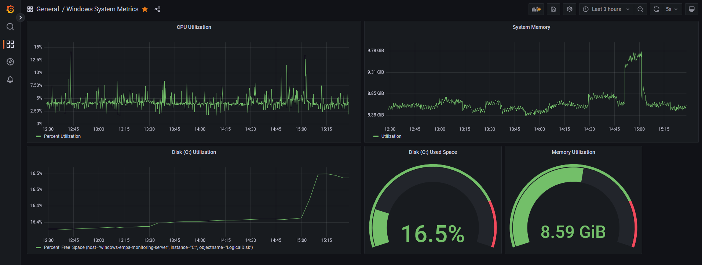

# Database storage and visualization deployment

Follow this guide to deploy an InfluxDB instance as well as a Grafana UI instance within docker containers on Windows.

## Installation instructions:
- install docker desktop on the WSL2 backend (https://docs.docker.com/desktop/windows/install/)
- navigate to the docker-monitoring folder
- modify the **docker-compose.yml** file to suit your needs (passwords, tokens, etc.)
- deploy the stack using the following command:

        docker-compose up -d

If the deployment was successful, user interfaces will be available at the following links:

- InfluxDB: http://localhost:8086
- Grafana: http://localhost:3000

## InfluxDB: create a new bucket and a token
- Use the UI to create a new bucket (where the data from rsudp will be stored):

    

- Add an API token (to be used by external applications like rsudp and processed, so that they can read and write to the bucket):

     

- The bucket name and token need to be added to the rsudp settings file (database_bucket and database_token settings in the write module).

## Optional: Telegraf installation on Windows
Telegraf is required if monitoring of resources of the Windows operating system is desired.

- Installation guide: https://docs.influxdata.com/telegraf/v1.21/introduction/installation/?t=Windows
- A configuration file is available: [telegraf.conf](telegraf.conf).Replace URL, bucket and token to match your influxDB configuration.

## Grafana: import or create dashboards
- The .json file for the dashboards is available in this folder: [rsudp dashboard](grafana_rsudp_dashboard.json) and [windows dashboard](grafana_windows_metrics_dashboard.json). It can be imported in a new instance of grafana:

     

### The rsudb dashboard:

### The windows resource monitoring dashboard:

